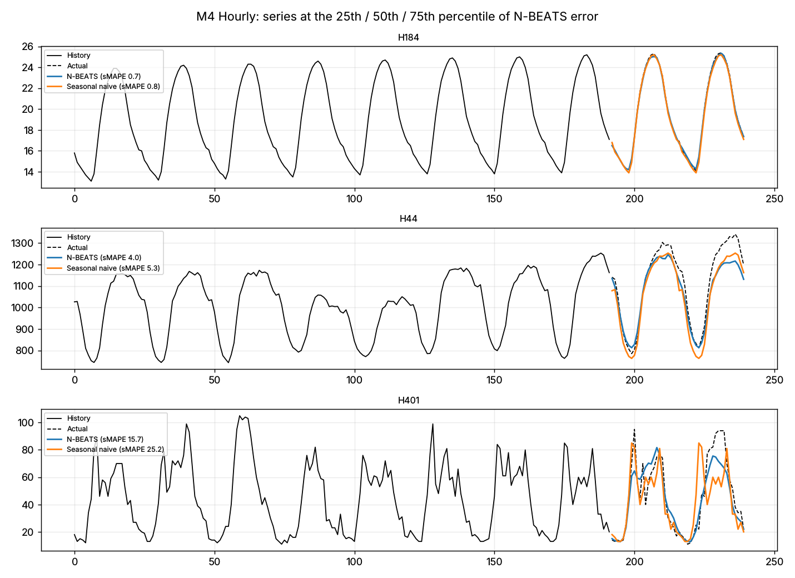

# N-BEATS vs the M4 Benchmarks — Global Deep Learning Forecasting in PyTorch

A from-scratch PyTorch implementation of **N-BEATS** (Oreshkin et al., ICLR 2020), with generic and interpretable trend/seasonality architectures. It is trained as one global model per frequency on the **M4 competition** Hourly (414 series), Daily (4,227) and Weekly (359) data, and scored against the competition's statistical benchmarks with the official sMAPE, MASE and OWA.

## Results on the official M4 test horizon

OWA is the official M4 score relative to Naive2 (lower is better; below 1 beats Naive2). The "best benchmark" is the benchmark with the lowest test OWA. Picking it with hindsight makes the comparison harder for N-BEATS, not easier.

| Frequency | Series × horizon | N-BEATS ensemble OWA | Best benchmark (OWA) | OWA gain, 95% bootstrap CI | Series where N-BEATS has lower sMAPE |
|---|---|---:|---|---|---:|
| **Hourly** | 414 × 48 | **0.442** | Seasonal naive (0.628) | **0.15 to 0.23** | 72% |
| **Weekly** | 359 × 13 | **0.777** | Theta (0.969) | **0.12 to 0.27** | 62% |
| Daily | 4,227 × 14 | 1.001 | Theta (0.999) | −0.007 to 0.001 (no gain) | 39% |

**Where deep learning earns its keep, and where it does not:**

- **Hourly:** a single global network learns daily cycles shared across hundreds of series. That beats the strongest per-series benchmark by 30% in OWA (sMAPE 9.2 vs 13.9).
- **Weekly:** the gain holds on a much smaller dataset (359 series). Ensembling matters here: the six members' validation sMAPE ranges from 6.9 to 8.2.
- **Daily:** nothing beats Naive2. Many M4 daily series behave close to a random walk; 37% of them are financial series. The networks' validation curves peaked early: the interpretable members' best step was 750–1,000 of 3,000, a sign they were fitting noise. This is the same conclusion as my [AAPL backtest](https://github.com/dbechrakis/aapl-forecasting-backtest): when the future is close to unpredictable, a flexible model has nothing to learn.

| Hourly method | sMAPE | MASE | OWA |
|---|---:|---:|---:|
| **N-BEATS ensemble (median of 6)** | **9.22** | **0.918** | **0.442** |
| N-BEATS interpretable only (3) | 9.66 | 0.933 | 0.457 |
| N-BEATS generic only (3) | 9.40 | 1.024 | 0.469 |
| Seasonal naive | 13.91 | 1.193 | 0.628 |
| SES | 18.09 | 2.384 | 0.990 |
| Naive2 | 18.38 | 2.395 | 1.000 |
| Theta | 18.13 | 2.454 | 1.006 |



Full tables and per-member training curves: [Hourly](outputs/hourly/) · [Weekly](outputs/weekly/) · [Daily](outputs/daily/). Each folder has `metrics.csv`, `summary.json` and a `members/` folder with each network's validation and test forecasts and its validation curve.

### How these numbers relate to the published N-BEATS

The paper trains 180 networks per frequency, with longer schedules, on GPUs. This repository trains 6 per frequency on a 4-core CPU, about 4–13 minutes each and roughly 2 hours in total. The aim is a faithful, inspectable implementation with an honest protocol, not a reproduction of the paper's leaderboard numbers. One Hourly member was still improving at its final step, so longer training would likely help there.

**Stack:** Python · PyTorch · NumPy · pandas · Matplotlib · GitHub Actions

## Protocol

- **Data:** the official M4 train/test files, SHA-256 pinned ([`data.py`](src/deepforecast/data.py)).
- **Benchmarks:** Naive, Seasonal naive, Naive2, SES and Theta, following the [M4 reference R code](https://github.com/Mcompetitions/M4-methods/blob/master/Benchmarks%20and%20Evaluation.R). That code applies a 90% autocorrelation seasonality test and, if it passes, classical multiplicative decomposition. Naive, Seasonal naive and Naive2 are deterministic and follow it exactly. SES and Theta pick the smoothing parameter by grid search rather than R's likelihood optimiser, so they can differ slightly from the reference.
- **No test leakage:**
  - The last horizon of every training series is held out as validation.
  - Each network keeps the weights with the best validation sMAPE.
  - The official test horizon is forecast once.
- **Ensemble:** 6 networks (generic and interpretable × lookbacks of 2, 3 and 5 horizons), combined by the median.
- **Scale-free training:** each window is divided by the maximum of its lookback, so one network serves series whose levels differ by orders of magnitude.

## Run

```bash
python -m pip install -r requirements.txt
make data       # pinned M4 downloads
make train      # ensemble members per frequency (CPU: about 1-2 hours in total)
make evaluate   # metrics, OWA, bootstrap intervals, figures
make check      # lint + tests + evidence check
```

## Repository structure

```text
src/deepforecast/
├── data.py        # Pinned M4 downloads, loading, validation split
├── metrics.py     # sMAPE, MASE, OWA (M4 definitions)
├── baselines.py   # Naive, Seasonal naive, Naive2, SES, Theta with the M4 seasonality test
├── nbeats.py      # Generic and interpretable (trend / seasonality) N-BEATS
└── training.py    # Global window sampler, scale-free training, best-validation weights
scripts/           # download_data, train_nbeats, evaluate
tests/             # metrics, benchmarks, windows/leakage, model shapes, a learning check
outputs/<freq>/    # metrics, summaries, figures, per-member forecasts and curves
```

## Limitations

- 6 networks per frequency and CPU-length training: smaller than the published ensemble.
- One test horizon per series, as in M4. The bootstrap intervals resample series, not time.
- No exogenous inputs or probabilistic forecasts; these are point forecasts only.

## Author

**Dimitris Bechrakis** — MSc Data Science, The American College of Greece. Code under the MIT license in `LICENSE`; the M4 data belong to the M4 competition organisers.
